# Database

Eighteen tables in MySQL. The schema is defined by `accesscardV24.sql`, checked
into the repository root, and that file is the authority. There are no
CodeIgniter migrations and there never will be; the reasoning is at the bottom of
this chapter.

## The shape of it

```mermaid
erDiagram
    barangay ||--o{ member : "lives in"
    member ||--o{ member : "head of"
    member ||--o{ member_sectors : "belongs to"
    sector ||--o{ member_sectors : "classifies"
    member ||--o{ member_services : "receives"
    services ||--o{ member_services : "recorded as"
    category ||--o{ services : "groups"
    sector ||--o{ services : "scopes"
    member ||--o| qr_control : "issued"
    users ||--o{ qr_control : "generated"
    member ||--o{ audit_trails : "changed"
    member ||--o{ family_media : "has linked media"
    users ||--o{ audit_trails : "by"
    subsidy ||--o{ distribution_batch : "hands out"
    distribution_batch ||--o{ batch_barangay : "targets"
    barangay ||--o{ batch_barangay : "targeted by"
    distribution_batch ||--o{ batch_sector : "targets"
    sector ||--o{ batch_sector : "targeted by"
    distribution_batch ||--o{ batch_eligibility : "serves"
    member ||--o{ batch_eligibility : "eligible for"
    distribution_batch ||--o{ subsidy_distribution : "recorded in"
    qr_control ||--o{ subsidy_distribution : "scanned as"
    member ||--o{ subsidy_distribution : "claimed by"
    subsidy ||--o{ subsidy_distribution : "handed out"
    users ||--o{ subsidy_distribution : "logged by"

    member {
        int memberID PK
        int headID FK "self-reference, defines the family"
        int barangayID FK
        varchar lastname
        varchar firstname
        enum sex "MALE, FEMALE"
        timestamp dt_deleted "null unless archived"
    }
    barangay {
        int barangayID PK
    }
    sector {
        int sectorID PK
    }
    category {
        int categoryID PK
    }
    services {
        int serviceID PK
        int categoryID FK
        int sectorID FK
    }
    member_sectors {
        int memberID PK
        int sectorID PK
    }
    member_services {
        int ID PK
        int memberID FK
        int serviceID FK
    }
    qr_control {
        int control_no PK
        int headID FK
        timestamp card_generated_at
        int card_generated_by FK
    }
    users {
        int userID PK
        enum account_level "viewer, scanner, administrator, developer, encoder"
        enum isactive "Enable, Disabled"
    }
    audit_trails {
        int auditID PK
        int userID FK
        int memberID FK
        text user_action
    }
    subsidy {
        int subsidy_type_id PK
    }
    distribution_batch {
        int batch_id PK
        int subsidy_type_id FK
        date scheduled_start
        date scheduled_end
        timestamp started_at "open when set"
        timestamp closed_at "open when null"
        int eligible_count
    }
    batch_barangay {
        int batch_id PK
        int barangayID PK
    }
    batch_sector {
        int batch_id PK
        int sectorID PK
    }
    batch_eligibility {
        int batch_id PK
        int headID PK
    }
    subsidy_distribution {
        int distribution_id PK
        int control_no FK
        int memberID FK
        int subsidy_type_id FK
        int batch_id FK
        int userID FK "null when the scanning account has no users row"
        timestamp dt_voided
    }
    family_media {
        int mediaID PK
        int headID FK "null while pending"
        enum kind "photo, signature"
        varchar source_filename "unique direct-folder filename"
        enum state "pending, linked, invalid, missing"
    }
    job_queue {
        int jobID PK
        varchar type
        enum status "pending, processing, done, partial, failed"
    }
```



`job_queue` stands alone with no foreign keys. It is the worker queue behind the
Excel import, covered in chapter 05.

Two things the diagram shows that the schema does not enforce. The link from
`subsidy` to `distribution_batch` is a real relationship in the data, but
`distribution_batch.subsidy_type_id` carries only an index (`idx_db_subsidy`),
not a foreign key constraint, unlike every other reference in the schema. And the
`member` self-reference is a genuine constraint, so a head's own row satisfies it
by pointing at itself rather than by being null.

## The one thing to understand first

`member.headID` points at another row in `member`. That single self-reference is
what makes a family.

A family is the set of `member` rows sharing a `headID`. The head is the member
whose `headID` equals its own `memberID`. There is no `family` table and no
`household` table; if you go looking for one you will not find it.

Everything downstream keys off the head rather than off individual members. A
control number is issued to a `headID`. Batch eligibility is a list of `headID`
values. The records list shows one row per family, which means one row per head,
with a member count beside it. When you are writing a query and cannot decide
whether to join on `memberID` or `headID`, the question to ask is whether you are
counting people or counting families.

## The tables

### People and place

**`member`** holds every person. Names, birthday, sex, civil status, education,
job, salary, contact number, relationship to the head, religion, and a free-text
address. `barangayID` links to the barangay; the address column holds what is
left after the barangay is split out, a change made in the v22 patches. Archival
is `dt_deleted`: a non-null timestamp means archived, and rows are never deleted
outright.

Names are stored uppercase. That is a v22 decision, and it matters on import
because matching is done against uppercase values.

**`barangay`** is the reference list of barangays. Small, seeded from the dump,
and effectively fixed.

**`users`** holds staff accounts. `account_level` is the enum
`viewer`, `scanner`, `administrator`, `developer`, `encoder`, and `isactive` is
`Enable` or `Disabled`. Accounts are disabled rather than deleted, so their audit
rows keep resolving to a name.

### Classification

**`sector`** lists the classifications a member can hold: senior citizen, person
with disability, and so on. **`member_sectors`** is the junction, keyed on
(`memberID`, `sectorID`). Before v22 this was a JSON list in a `member.sectorID`
column; that column is gone, and a member's sectors are a relation now.

**`category`** and **`services`** describe what a member receives or is enrolled
in. A service belongs to one category and is scoped to one sector.
**`member_services`** records that a member has that service. Note that this
table has its own surrogate key `ID` rather than a composite primary key, unlike
the other junctions.

### Cards

**`qr_control`** is one row per family head: `control_no` as the primary key,
`headID` as the family, and `card_generated_at` and `card_generated_by`
recording when the card was actually produced and by whom. A row can exist with a
null `card_generated_at`, meaning a control number has been allocated but no card
printed yet.

### Distribution

**`subsidy`** lists subsidy types. Keyed `subsidy_type_id`. This is the "what is
being handed out" list, and it is not the services list.

**`distribution_batch`** is one distribution event: a name, a venue, the subsidy
type bound at plot time, a scheduled date range with daily start and end times, a
colour for the calendar, and the two timestamps that decide whether it is open.
`eligible_count` is denormalised from the eligibility roster so the dashboard does
not count rows on every page load.

A batch is open when `closed_at` is NULL and `started_at` is not NULL. That exact
condition appears in queries throughout the scanner code, and getting it slightly
wrong is a good way to make a batch invisible at the venue.

**`batch_barangay`** and **`batch_sector`** are the targeting: which barangays and
which sectors this batch covers. **`batch_eligibility`** is the resolved answer,
one row per eligible `headID`, built by `EligibilityBuilder` when the batch is
plotted or its targeting changes.

**`subsidy_distribution`** is the scan record: which control number was scanned,
for which member, of which subsidy type, in which batch, by which user, on which
date. `userID` is nullable and is NULL for a scan made from a developer account.
`dt_voided` marks a voided handout; rows are voided, not deleted.

### Infrastructure

**`audit_trails`** records changes to family records: the action, a description, a
longer description, the IP address and user agent, the acting `userID`, and the
`memberID` affected. Chapter 16 covers what gets written and when.

**`job_queue`** is the background work queue: a `type` dispatched to a handler, a
JSON `payload`, a status, progress counters, a checkpoint for resuming, a result
blob, and locking columns. Chapter 05 covers the worker.

**`family_media`** is the V24 registry for family portraits and signatures. It
stores the linked family head when known, the source control number and filename,
the kind, state, private application URL, and the fingerprint needed to notice a
change. It is not a BLOB column and it does not contain image bytes. The JPEG or
PNG remains in the private external folder configured by
`familymediasettings.root`; the one-minute worker reconciles that folder into
this table. A row can be pending before its control number resolves to an
imported head, linked when it is available, or missing after direct source-file
deletion. Chapter 11 gives the operator workflow and chapter 06 covers matched
MySQL and media-root backup restoration.

## Why there are no migrations

The database belongs to the CSWD deployment, not to this repository. It is
restored from a dump, patched in place when the schema changes, and dumped again.
Code follows the dump; the dump does not follow the code.

This has one consequence you will feel immediately: a column name or enum value
invented in code and not present in the dump fails at runtime, not at lint time.
`composer lint` will not catch it. The tests may not catch it either, if the
SQLite test path is the one that runs. Check the dump.

Schema changes are written as patch files under `sql/patches/`, applied to
databases that already carry data, and then folded into a new `accesscardVNN.sql`
dump. A fresh setup only needs the dump; the patches exist for databases that
predate it.

The patch history, which doubles as a changelog of what the schema has been
through:

| Patch | What it did |
|---|---|
| `v17-indexes.sql` | performance indexes |
| `v18-refdata-cleanup.sql` | reference-data tidying |
| `v18-uppercase-names.sql` | began the move to uppercase name storage |
| `v19-subsidy-rename.sql` | renamed aid to subsidy throughout |
| `v20-barangay-backfill.sql` | populated `member.barangayID` from the address text |
| `v20-eligibility.sql` | added the batch eligibility roster |
| `v21-batch-schedule.sql` | added the batch schedule columns |
| `v22-uppercase.sql` | completed uppercase storage |
| `v22-barangay-fk.sql` | added the barangay foreign key |
| `v22-normalize.sql` | added `member_sectors`, grouped services by key |
| `v22-normalize-drop.sql` | dropped the old columns, run last |
| `v23-add-iw-sector.sql` | added the `IW` (Informal Worker) sector row |
| `v24-family-media.sql` | added the `family_media` registry for private external media files |

Order within a version matters. Backfills run before the constraints that depend
on them, and `v22-normalize-drop.sql` runs only after the commands that read the
old text columns have finished with them.

`app/Database/Seeds/` holds one seeder, `DummyDataSeeder`, which generates about
50,000 dummy members in family units for load work. It never touches sectors,
services, or user accounts, and it never creates a table or a column. Staff
accounts come with the dump, not from a seeder. Do not run it against real
records.

## Rules

Copied from the conventions this codebase is held to. Terse on purpose.

**Scope:** model responsibilities, feature grouping, query placement, schema
truth.

### Rule 1: Models mirror the feature subnamespaces

`app/Models/` groups by feature, matching the controllers (see
`docs/01-architecture.md`):

- `Auth/UserModel` - login, password hashing, account creation.
- `Families/` - `MemberModel`, `MemberServiceModel`, `FamilyFormOptionsModel`.
- `Audit/AuditTrailsModel` - audit inserts + list queries (see
  `docs/16-audit-trails.md`).
- `Lookups/` - `SectorModel`, `ServiceModel`, `CategoryModel`.
- `Scanner/`, `Jobs/` - QR/scan and queued-job models.
- Shared cross-feature queries: `DashboardModel`, `SearchModel`,
  `ViewLayoutModel` (top level).
- Reusable query behavior lives in `app/Models/Concerns/` traits
  (`MemberQueryFilters`, `NormalizesIds`, `RecordStatus`,
  `ResolvesMemberNames`, ...), mixed into models - not copy-pasted.

### Rule 2: Queries live in models; controllers and libraries only call them

Controllers/libraries never touch the query builder. Cross-reference:
`docs/01-architecture.md` Rule 3 is the same boundary from the controller side.

### Rule 3: Canonical model shape

Canonical - `app/Models/Families/MemberModel.php:16`:

```php
class MemberModel extends Model
{
    use MemberQueryFilters;
    use NormalizesIds;
    use ResolvesSectorNames;

    public const VALIDATION_RULES = [
        'firstname' => 'required|max_length[100]',
        'sex' => 'permit_empty|in_list[MALE,FEMALE]',
        // ...
    ];

    protected $table = 'member';
    protected $primaryKey = 'memberID';
    protected $returnType = 'array';
    protected $allowedFields = [ /* exact dump column names */ ];
```

Pattern notes:
- `$returnType = 'array'` throughout - no entity classes.
- Validation rules as a `public const` so controllers/tests can reference the
  same source (`app/Models/Families/MemberModel.php:22`).
- A member's sectors are a relation, not a column: `member_sectors` via
  `app/Models/Families/MemberSectorModel.php`. V22 dropped the `member.sectorID`
  JSON list, so nothing normalizes ids into a column on the way in.

### Rule 4: Schema truth is the SQL dump - non-negotiable

- **No migrations, ever.** Schema source of truth is the current dump,
  `accesscardV24.sql`. Never alter schema in code.
- Column names, allowed enum values, and role names match the dump exactly.
  Enum values are case-sensitive in practice: `sex` is `in_list[MALE,FEMALE]`
  (`app/Models/Families/MemberModel.php:29`), not `[Male,Female]`.
- The `users.account_level` enum is `viewer`, `scanner`, `administrator`,
  `developer`, `encoder`. There is no `User` level; the encoding role is
  `encoder` in the schema, the code, and the interface.
- Seeds (`app/Database/Seeds/`) never create tables or columns. The only seeder,
  `DummyDataSeeder`, writes ~50,000 dummy `member` rows for load work; staff
  accounts ship in the dump.

**Why:** the DB is owned by the CSWD deployment; code follows the dump, not
the other way around.
